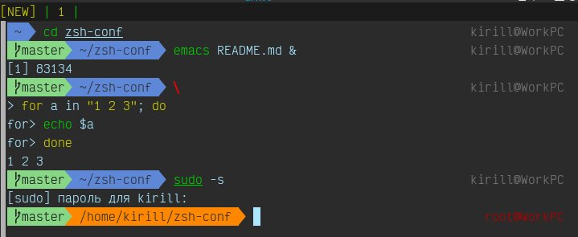

# My crutch zsh config
True, it’s better to use some kind of framework like oh-my-zsh.
But if you still decide to use it, just make a symlink from $HOME/zsh-conf/.zshrc to $HOME/.zshrc:
`ln -s $HOME/zsh-conf/.zshrc $HOME/.zshrc`

You can also create symlink on `.vimrc` and `.screenrc`.

